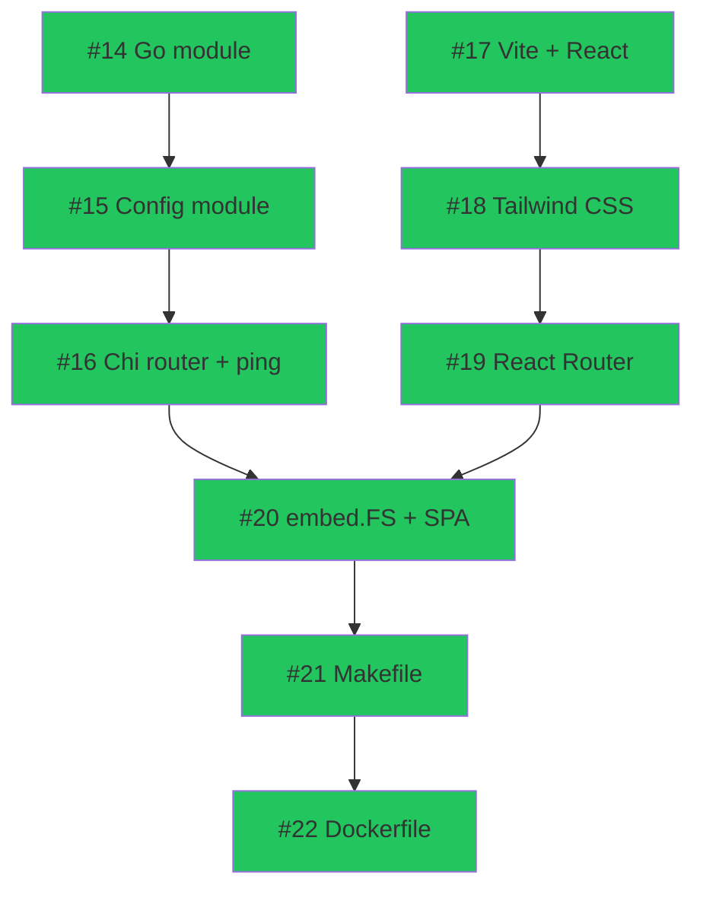
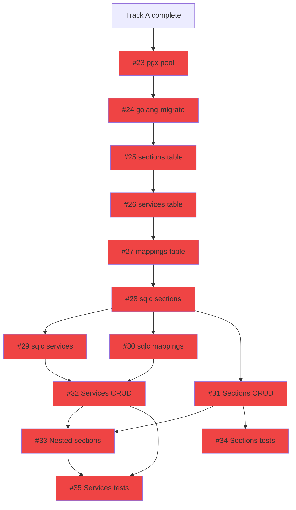
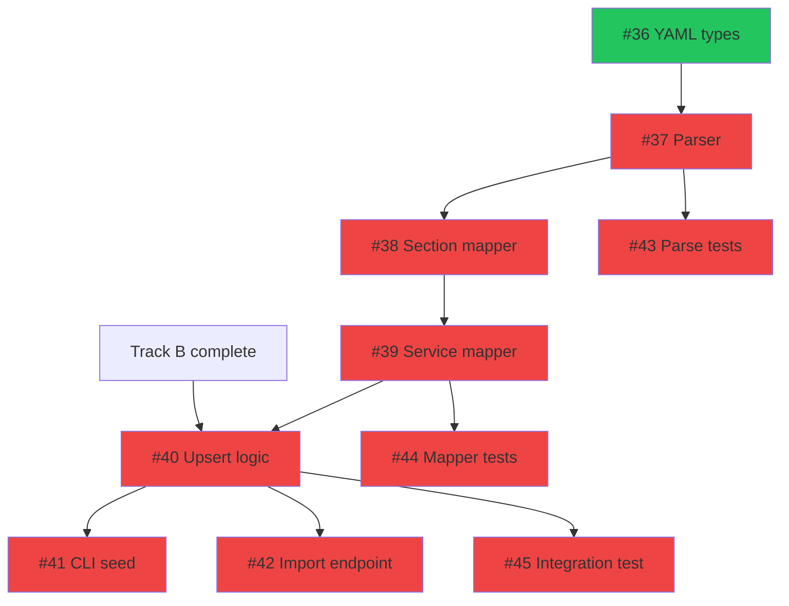
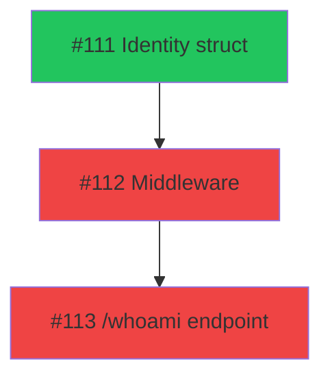

# Phase 1: Foundation & Infrastructure

> 35 issues across 4 tracks. **11 ready now**, 24 blocked by dependencies.
> Updated: 2026-03-24

## Summary

| Track | Name              | Total  | Ready  | Blocked | Epic | Models        |
| ----- | ----------------- | :----: | :----: | :-----: | ---- | ------------- |
| A     | Project Scaffold  |   9    |   9    |    0    | #2   | Mixed         |
| B     | Database + CRUD   |   13   |   0    |   13    | #3   | Mixed         |
| C     | Dashy Importer    |   10   |   1    |    9    | #4   | Mixed         |
| D     | Authelia Identity |   3    |   1    |    2    | #10  | Mixed         |
|       | **Total**         | **35** | **11** | **24**  |      |               |

**Critical path:** Track A → Track B → Track C (seed production data) → Phase 2

**Phase entry criteria:** Empty repo (current state).

**Phase exit criteria:** `make dev` starts Go backend + Vite dev server. Database has schema with CRUD API working. Production Dashy config seeded into database. Authelia identity middleware attached. All tests pass.

---

## Track A: Project Scaffold

> Foundation for everything. Frontend and backend project structure, build tooling, Docker.
> Depends on: Nothing

| #   | Issue                                                         | Title                                               | Size | Blocker | Status | Notes                          |
| --- | ------------------------------------------------------------- | --------------------------------------------------- | :--: | ------- | ------ | ------------------------------ |
| 1   | [#14](https://github.com/PatrickFanella/dash/issues/14)       | Initialize Go module with core dependencies         |  S   | None    | READY  | Do first — everything imports  |
| 2   | [#17](https://github.com/PatrickFanella/dash/issues/17)       | Initialize Vite + React + TypeScript frontend       |  S   | None    | READY  | Parallel with #14              |
| 3   | [#15](https://github.com/PatrickFanella/dash/issues/15)       | Go config module — environment variable loading     |  S   | #14     | READY  |                                |
| 4   | [#18](https://github.com/PatrickFanella/dash/issues/18)       | Tailwind CSS installation and base configuration    |  S   | #17     | READY  |                                |
| 5   | [#16](https://github.com/PatrickFanella/dash/issues/16)       | Chi router setup + /api/v1 route group + ping       |  S   | #15     | READY  |                                |
| 6   | [#19](https://github.com/PatrickFanella/dash/issues/19)       | React Router setup with route stubs                 |  S   | #18     | READY  |                                |
| 7   | [#20](https://github.com/PatrickFanella/dash/issues/20)       | Go embed.FS — serve frontend + SPA fallback         |  M   | #16,#19 | READY  | Connects Go + React            |
| 8   | [#21](https://github.com/PatrickFanella/dash/issues/21)       | Root Makefile with dev, build, docker targets        |  M   | #20     | READY  |                                |
| 9   | [#22](https://github.com/PatrickFanella/dash/issues/22)       | Multi-stage Dockerfile targeting scratch             |  M   | #21     | READY  |                                |



**Parallelizable:** #14 (Go) and #17 (React) start simultaneously. Two independent chains merge at #20 (embed.FS). Prioritize #14 — backend modules depend on it.

---

## Track B: Database Schema + Migrations + CRUD API

> Full data layer: PostgreSQL schema, sqlc code generation, REST endpoints, tests.
> Depends on: Track A (#14 Go module, #16 Chi router)

| #   | Issue                                                         | Title                                               | Size | Blocker    | Status  | Notes                        |
| --- | ------------------------------------------------------------- | --------------------------------------------------- | :--: | ---------- | ------- | ---------------------------- |
| 1   | [#23](https://github.com/PatrickFanella/dash/issues/23)       | pgx connection pool setup                           |  S   | Track A    | BLOCKED |                              |
| 2   | [#24](https://github.com/PatrickFanella/dash/issues/24)       | golang-migrate setup with migration runner          |  S   | #23        | BLOCKED |                              |
| 3   | [#25](https://github.com/PatrickFanella/dash/issues/25)       | SQL migration: create sections table                |  XS  | #24        | BLOCKED | First migration              |
| 4   | [#26](https://github.com/PatrickFanella/dash/issues/26)       | SQL migration: create services table                |  XS  | #25        | BLOCKED |                              |
| 5   | [#27](https://github.com/PatrickFanella/dash/issues/27)       | SQL migration: create service_section_mappings      |  XS  | #26        | BLOCKED | FK → services, sections      |
| 6   | [#28](https://github.com/PatrickFanella/dash/issues/28)       | sqlc configuration + section queries                |  S   | #27        | BLOCKED | Needs full schema            |
| 7   | [#29](https://github.com/PatrickFanella/dash/issues/29)       | sqlc queries for services                           |  S   | #28        | BLOCKED |                              |
| 8   | [#30](https://github.com/PatrickFanella/dash/issues/30)       | sqlc queries for service-section mappings            |  S   | #28        | BLOCKED | Parallel with #29            |
| 9   | [#31](https://github.com/PatrickFanella/dash/issues/31)       | Sections CRUD API endpoints                         |  M   | #28        | BLOCKED |                              |
| 10  | [#32](https://github.com/PatrickFanella/dash/issues/32)       | Services CRUD API endpoints                         |  M   | #29, #30   | BLOCKED |                              |
| 11  | [#33](https://github.com/PatrickFanella/dash/issues/33)       | GET /api/v1/sections — nested services response     |  M   | #31, #32   | BLOCKED | Primary frontend endpoint    |
| 12  | [#34](https://github.com/PatrickFanella/dash/issues/34)       | Integration tests: sections CRUD                    |  M   | #31        | BLOCKED | Real test database           |
| 13  | [#35](https://github.com/PatrickFanella/dash/issues/35)       | Integration tests: services CRUD                    |  M   | #32, #33   | BLOCKED |                              |



**Parallelizable after #28:** #29, #30, #31 can start simultaneously. After #31 and #32: #33, #34, #35.

---

## Track C: Dashy Config Importer

> Parses production Dashy conf.yml and seeds the database. CLI + API endpoint.
> Depends on: Track B (database schema + CRUD must exist for seeding)

| #   | Issue                                                         | Title                                               | Size | Blocker    | Status  | Notes                        |
| --- | ------------------------------------------------------------- | --------------------------------------------------- | :--: | ---------- | ------- | ---------------------------- |
| 1   | [#36](https://github.com/PatrickFanella/dash/issues/36)       | Dashy YAML type definitions                         |  XS  | None       | READY   | Pure types, no code deps     |
| 2   | [#37](https://github.com/PatrickFanella/dash/issues/37)       | YAML parser: read and unmarshal                     |  S   | #36        | BLOCKED |                              |
| 3   | [#38](https://github.com/PatrickFanella/dash/issues/38)       | Mapper: Dashy sections → DB section records         |  S   | #37        | BLOCKED |                              |
| 4   | [#39](https://github.com/PatrickFanella/dash/issues/39)       | Mapper: Dashy items → DB service records            |  M   | #38        | BLOCKED | Handles statusCheckUrl edge  |
| 5   | [#40](https://github.com/PatrickFanella/dash/issues/40)       | Upsert logic for idempotent imports                 |  M   | #39, TB    | BLOCKED | Needs Track B database       |
| 6   | [#41](https://github.com/PatrickFanella/dash/issues/41)       | CLI seed subcommand                                 |  S   | #40        | BLOCKED |                              |
| 7   | [#42](https://github.com/PatrickFanella/dash/issues/42)       | POST /api/v1/import endpoint                        |  S   | #40        | BLOCKED | Parallel with #41            |
| 8   | [#43](https://github.com/PatrickFanella/dash/issues/43)       | Unit tests: YAML parsing                            |  S   | #37        | BLOCKED | Uses production config       |
| 9   | [#44](https://github.com/PatrickFanella/dash/issues/44)       | Unit tests: mapping edge cases                      |  S   | #39        | BLOCKED |                              |
| 10  | [#45](https://github.com/PatrickFanella/dash/issues/45)       | Integration test: full seed of production config    |  M   | #40, #24   | BLOCKED | Seeds 42 services            |



**Parallelizable:** #36 can start immediately (even during Track A). After #37: #43 (tests) in parallel with #38. After #40: #41, #42, #45 all in parallel.

---

## Track D: Authelia Identity Middleware

> Reads Authelia forwarded headers, attaches user identity to request context.
> Depends on: Track A (#16 Chi router)

| #   | Issue                                                         | Title                                               | Size | Blocker | Status  | Notes                    |
| --- | ------------------------------------------------------------- | --------------------------------------------------- | :--: | ------- | ------- | ------------------------ |
| 1   | [#111](https://github.com/PatrickFanella/dash/issues/111)     | Identity struct and header parsing function          |  XS  | None    | READY   | Pure types + function    |
| 2   | [#112](https://github.com/PatrickFanella/dash/issues/112)     | Chi middleware: attach identity to request context   |  S   | #111    | BLOCKED |                          |
| 3   | [#113](https://github.com/PatrickFanella/dash/issues/113)     | GET /api/v1/whoami endpoint                          |  XS  | #112    | BLOCKED |                          |



**Parallelizable:** Track D is fully independent from Tracks B-C. It can run in parallel with the entire database/importer chain.

---

## Phase 1 Execution Order

```
Week 1:  Track A (scaffold) + Track C #36 + Track D #111
         ├── Track A: #14 + #17 parallel → #15 + #18 → #16 + #19 → #20 → #21 → #22
         ├── Track C: #36 (YAML types — head start)
         └── Track D: #111 (identity struct — head start)
         └── Gate: `make dev` starts both servers, `make docker` builds scratch image

Week 2:  Track B (database) + Track C (parsing) + Track D (middleware)
         ├── Track B: #23 → #24 → #25 → #26 → #27 → #28 → (#29, #30, #31 parallel)
         ├── Track C: #37 → (#38, #43 parallel) → #39 → #44
         └── Track D: #112 → #113

Week 3:  Track B (CRUD + tests) + Track C (seeding)
         ├── Track B: #32 → #33, #34, #35
         ├── Track C: #40 → (#41, #42, #45 parallel)
         └── Gate: all CRUD working, production config seeded, auth middleware attached
```

**Phase 1 → Phase 2 handoff:** All 4 tracks complete. `GET /api/v1/sections` returns seeded Dashy data. `GET /api/v1/whoami` returns Authelia identity. `make dev` runs everything locally.
