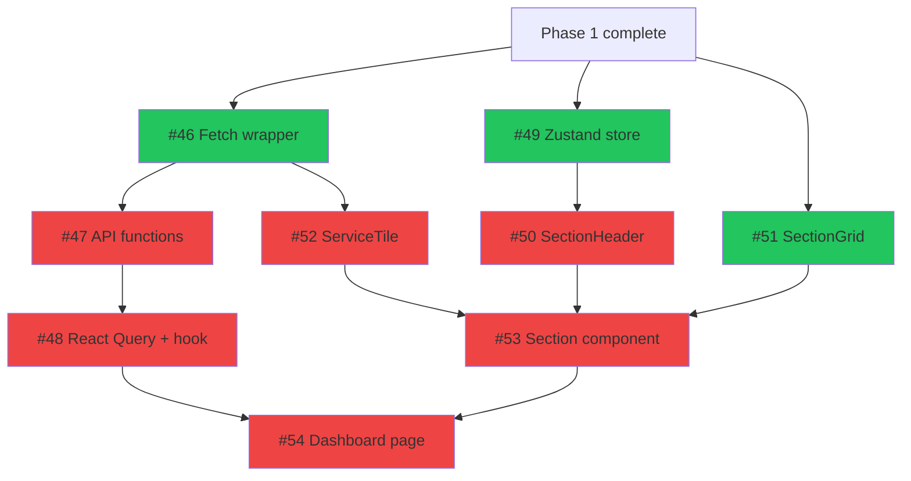
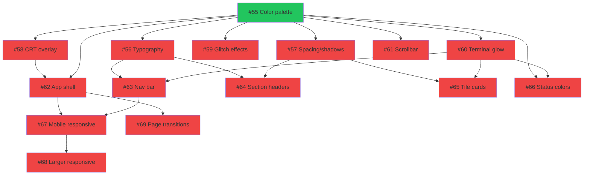
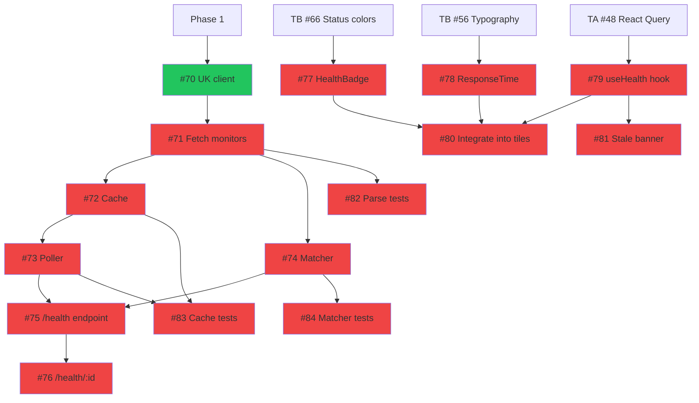
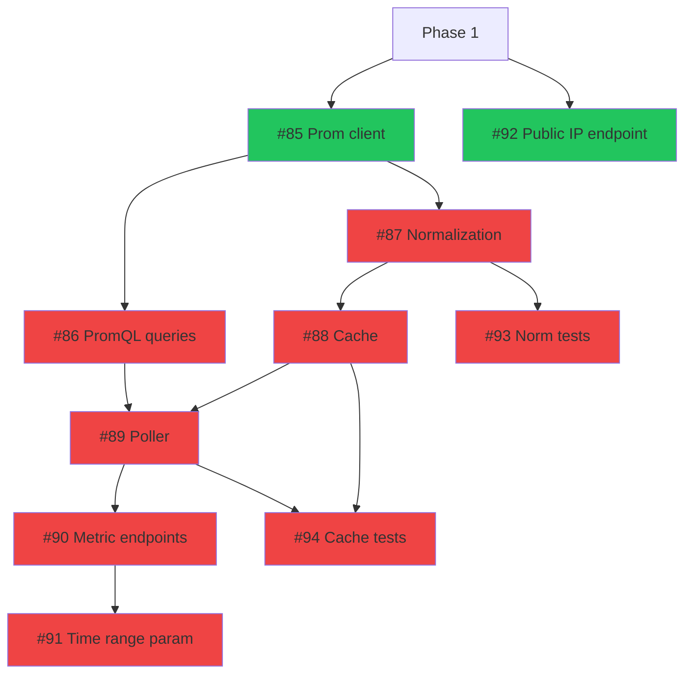
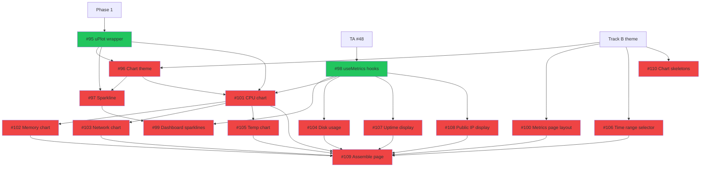
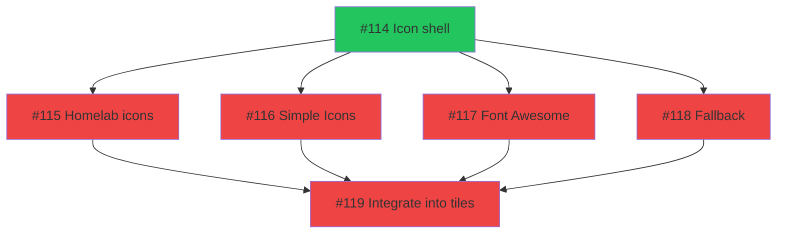
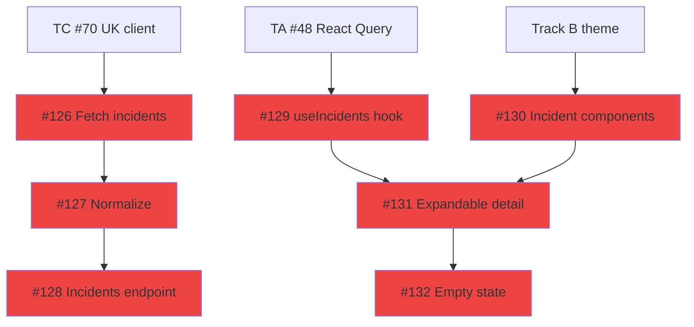

# Phase 2: Dashboard & Live Data

> 80 issues across 7 tracks. **11 ready** (when Phase 1 completes), 69 blocked by internal dependencies.
> Updated: 2026-03-24

## Summary

| Track | Name                | Total  | Ready  | Blocked | Epic | Parallel group |
| ----- | ------------------- | :----: | :----: | :-----: | ---- | -------------- |
| A     | Dashboard Frontend  |   9    |   3    |    6    | #5   | Alpha          |
| B     | SUBCULT Theme       |   15   |   1    |   14    | #6   | Beta (after A) |
| C     | Uptime Kuma         |   15   |   1    |   14    | #7   | Alpha          |
| D     | Prometheus          |   10   |   2    |    8    | #8   | Alpha          |
| E     | Metrics UI          |   16   |   2    |   14    | #9   | Beta (after B,D) |
| F     | Icon System         |   6    |   1    |    5    | #11  | Alpha          |
| G     | Incident History    |   7    |   1    |    6    | #13  | Beta (after C) |
|       | **Total**           | **80** | **11** | **69**  |      |                |

**Parallel groups:**

- **Alpha** (Tracks A, C, D, F): All start immediately when Phase 1 completes. Four independent tracks running simultaneously. Track A builds the frontend shell; C and D build the data backends; F builds the icon system.
- **Beta** (Tracks B, E, G): Blocked by Alpha tracks. Track B needs Track A components to style. Track E needs Track B (theme) + Track D (Prometheus API). Track G needs Track C (health data).

**Critical path:** Track A (dashboard components) → Track B (theme) → Track E (metrics UI) → full dashboard

**Phase entry criteria:** Phase 1 complete (scaffold, database, importer, auth all working).

**Phase exit criteria:** Dashboard at `/` renders all service tiles with health status from Uptime Kuma, SUBCULT aesthetic fully applied, icons rendering from all three sources, `/metrics` page shows live Prometheus data with sparklines and full-size charts, incident history viewable on service tiles.

---

## Model Assignment Legend

Each issue includes a recommended LLM model based on task complexity and model strengths.

| Abbrev   | Model           | Use for                                                                                      |
| -------- | --------------- | -------------------------------------------------------------------------------------------- |
| `opus`   | Opus 4.6        | Architecture, complex integration, pattern-setting implementations, creative design decisions |
| `5.4`    | GPT-5.4         | Complex backend logic, external API integration, data transformation, strong reasoning tasks  |
| `sonnet` | Sonnet 4.6      | Standard implementation, moderate complexity components, Go handlers, React wiring            |
| `codex`  | GPT-5.3-codex   | Pattern-following, boilerplate, simple components, tests, XS/S tasks with clear specs         |

**Distribution:** 8 opus, 8 gpt-5.4, 27 sonnet, 37 codex — heaviest models reserved for foundation-setting and integration-heavy work.

---

## Track A: Dashboard Frontend

> React components for the main dashboard page. Layout, sections, tiles, data hooks.
> Depends on: Phase 1 (database CRUD API must be serving data)

| #   | Issue                                                         | Title                                               | Size | Model    | Blocker | Status  | Notes                     |
| --- | ------------------------------------------------------------- | --------------------------------------------------- | :--: | -------- | ------- | ------- | ------------------------- |
| 1   | [#46](https://github.com/PatrickFanella/dash/issues/46)       | Typed fetch wrapper module                          |  S   | `sonnet` | Phase 1 | READY   | Foundation for all API — needs solid TS generics    |
| 2   | [#49](https://github.com/PatrickFanella/dash/issues/49)       | Zustand store: collapsed sections + localStorage    |  S   | `codex`  | Phase 1 | READY   | Well-documented pattern   |
| 3   | [#51](https://github.com/PatrickFanella/dash/issues/51)       | SectionGrid component                               |  S   | `codex`  | Phase 1 | READY   | Pure CSS grid layout      |
| 4   | [#47](https://github.com/PatrickFanella/dash/issues/47)       | API functions: fetchSections, fetchServices          |  S   | `codex`  | #46     | BLOCKED | Follows #46 patterns      |
| 5   | [#52](https://github.com/PatrickFanella/dash/issues/52)       | ServiceTile component                                |  S   | `sonnet` | #46     | BLOCKED | Needs careful type mapping from API    |
| 6   | [#48](https://github.com/PatrickFanella/dash/issues/48)       | React Query provider + useSections hook              |  S   | `sonnet` | #47     | BLOCKED | Foundational data layer   |
| 7   | [#50](https://github.com/PatrickFanella/dash/issues/50)       | SectionHeader component                              |  S   | `codex`  | #49     | BLOCKED | Needs collapse state      |
| 8   | [#53](https://github.com/PatrickFanella/dash/issues/53)       | Section component (compose header + grid + tiles)    |  M   | `sonnet` | #50,#51,#52 | BLOCKED | Composes 3 components  |
| 9   | [#54](https://github.com/PatrickFanella/dash/issues/54)       | Dashboard page: fetch data + render sections         |  M   | `opus`   | #48,#53 | BLOCKED | THE dashboard page — integrates all Track A work |



**Parallelizable:** #46, #49, #51 all start simultaneously. After #46: #47 and #52 in parallel. After #49: #50. All converge at #53, then #54.

---

## Track B: SUBCULT Design System + Theme

> Full visual identity. Tailwind tokens, CRT/glitch effects, component styling, responsive tuning.
> Depends on: Track A (components must exist to style them)

| #   | Issue                                                         | Title                                               | Size | Model    | Blocker    | Status  | Notes                          |
| --- | ------------------------------------------------------------- | --------------------------------------------------- | :--: | -------- | ---------- | ------- | ------------------------------ |
| 1   | [#55](https://github.com/PatrickFanella/dash/issues/55)       | SUBCULT color palette in Tailwind config            |  S   | `opus`   | Phase 1    | READY   | Sets aesthetic direction — everything derives from this |
| 2   | [#56](https://github.com/PatrickFanella/dash/issues/56)       | Typography: font selection + scale                  |  S   | `sonnet` | #55        | BLOCKED |                                |
| 3   | [#57](https://github.com/PatrickFanella/dash/issues/57)       | Spacing, border radius, shadow design tokens        |  S   | `codex`  | #55        | BLOCKED | Config tokens, clear spec      |
| 4   | [#58](https://github.com/PatrickFanella/dash/issues/58)       | CRT scanline overlay component                      |  S   | `sonnet` | #55        | BLOCKED | Creative CSS technique         |
| 5   | [#59](https://github.com/PatrickFanella/dash/issues/59)       | Glitch effect keyframe animations                   |  M   | `opus`   | #55        | BLOCKED | Complex multi-step animations, creative |
| 6   | [#60](https://github.com/PatrickFanella/dash/issues/60)       | Terminal glow effect utilities                       |  S   | `sonnet` | #55        | BLOCKED |                                |
| 7   | [#61](https://github.com/PatrickFanella/dash/issues/61)       | Scrollbar styling                                    |  XS  | `codex`  | #55        | BLOCKED |                                |
| 8   | [#62](https://github.com/PatrickFanella/dash/issues/62)       | App shell: background, noise texture, atmosphere    |  M   | `5.4`    | #55, #58   | BLOCKED | Complex composition, atmospheric layering |
| 9   | [#63](https://github.com/PatrickFanella/dash/issues/63)       | Navigation bar styling                               |  M   | `sonnet` | #56, #60   | BLOCKED | Needs fonts + glow             |
| 10  | [#64](https://github.com/PatrickFanella/dash/issues/64)       | Section header styling                               |  S   | `codex`  | #56, #57   | BLOCKED | Needs fonts + spacing          |
| 11  | [#65](https://github.com/PatrickFanella/dash/issues/65)       | Service tile card styling                            |  M   | `sonnet` | #57, #60   | BLOCKED | Needs spacing + glow           |
| 12  | [#66](https://github.com/PatrickFanella/dash/issues/66)       | Status indicator color system                        |  S   | `codex`  | #55, #60   | BLOCKED | Config mapping                 |
| 13  | [#67](https://github.com/PatrickFanella/dash/issues/67)       | Responsive breakpoint tuning: mobile                 |  M   | `opus`   | #62, #63   | BLOCKED | HITL — complex layout judgment |
| 14  | [#68](https://github.com/PatrickFanella/dash/issues/68)       | Responsive breakpoint tuning: tablet/desktop/ultra   |  M   | `5.4`    | #67        | BLOCKED | HITL — extends #67 patterns    |
| 15  | [#69](https://github.com/PatrickFanella/dash/issues/69)       | Page transition animations                           |  S   | `sonnet` | #62        | BLOCKED |                                |



**Parallelizable after #55:** Six issues (#56, #57, #58, #59, #60, #61) can all start simultaneously. This is the most parallelizable moment in the track. Second wave: #62-#66 after their specific deps. Final wave: #67-#69.

**HITL gates:** #67 and #68 (responsive tuning) require visual review before merge.

---

## Track C: Uptime Kuma Integration

> Health monitoring: Go backend polls Uptime Kuma, caches results, frontend displays on tiles.
> Depends on: Phase 1 (scaffold), Track A (frontend components), Track B (#66 status colors)

| #   | Issue                                                         | Title                                               | Size | Model    | Blocker      | Status  | Notes                     |
| --- | ------------------------------------------------------------- | --------------------------------------------------- | :--: | -------- | ------------ | ------- | ------------------------- |
| 1   | [#70](https://github.com/PatrickFanella/dash/issues/70)       | Uptime Kuma HTTP client setup                       |  S   | `sonnet` | Phase 1      | READY   | Backend — start early     |
| 2   | [#71](https://github.com/PatrickFanella/dash/issues/71)       | Fetch all monitor statuses                          |  M   | `5.4`    | #70          | BLOCKED | External API parsing, response mapping |
| 3   | [#72](https://github.com/PatrickFanella/dash/issues/72)       | In-memory cache with configurable TTL               |  S   | `sonnet` | #71          | BLOCKED | Go concurrency patterns   |
| 4   | [#73](https://github.com/PatrickFanella/dash/issues/73)       | Background polling goroutine                        |  S   | `sonnet` | #72          | BLOCKED | Goroutine lifecycle       |
| 5   | [#74](https://github.com/PatrickFanella/dash/issues/74)       | Service-to-monitor matching logic                   |  M   | `5.4`    | #71          | BLOCKED | Heuristic matching, fuzzy logic |
| 6   | [#75](https://github.com/PatrickFanella/dash/issues/75)       | GET /api/v1/health endpoint                         |  M   | `sonnet` | #73, #74     | BLOCKED | Coordinates subsystems    |
| 7   | [#76](https://github.com/PatrickFanella/dash/issues/76)       | GET /api/v1/health/:serviceId endpoint              |  S   | `codex`  | #75          | BLOCKED | Follows #75 pattern       |
| 8   | [#77](https://github.com/PatrickFanella/dash/issues/77)       | HealthBadge frontend component                      |  S   | `codex`  | TB #66       | BLOCKED | Simple status display     |
| 9   | [#78](https://github.com/PatrickFanella/dash/issues/78)       | ResponseTime + UptimePercentage display components  |  S   | `codex`  | TB #56       | BLOCKED | Display components        |
| 10  | [#79](https://github.com/PatrickFanella/dash/issues/79)       | useHealth React Query hook                          |  S   | `codex`  | TA #48       | BLOCKED | Standard hook pattern     |
| 11  | [#80](https://github.com/PatrickFanella/dash/issues/80)       | Integrate health components into ServiceTile        |  M   | `sonnet` | #77,#78,#79  | BLOCKED | Wires it all together     |
| 12  | [#81](https://github.com/PatrickFanella/dash/issues/81)       | StaleDataBanner component                           |  S   | `codex`  | #79          | BLOCKED |                           |
| 13  | [#82](https://github.com/PatrickFanella/dash/issues/82)       | Unit tests: Uptime Kuma response parsing            |  S   | `codex`  | #71          | BLOCKED | httptest mocks            |
| 14  | [#83](https://github.com/PatrickFanella/dash/issues/83)       | Unit tests: cache TTL and error handling            |  S   | `codex`  | #72, #73     | BLOCKED |                           |
| 15  | [#84](https://github.com/PatrickFanella/dash/issues/84)       | Unit tests: service-to-monitor matching             |  S   | `sonnet` | #74          | BLOCKED | Edge cases need reasoning |



**Backend chain (#70-#76):** Fully independent of frontend tracks. Can be built while Tracks A and B are in progress. After #71: #72, #74, #82 in parallel. After #73+#74: #75.

**Frontend chain (#77-#81):** Blocked by both Track B (theme) and Track A (React Query). This is the cross-track dependency bottleneck.

---

## Track D: Prometheus Integration

> System metrics: Go backend queries Prometheus, normalizes time-series data, caches with TTL.
> Depends on: Phase 1 (scaffold only — no frontend dependency)

| #   | Issue                                                         | Title                                               | Size | Model    | Blocker | Status  | Notes                     |
| --- | ------------------------------------------------------------- | --------------------------------------------------- | :--: | -------- | ------- | ------- | ------------------------- |
| 1   | [#85](https://github.com/PatrickFanella/dash/issues/85)       | Prometheus HTTP API client setup                    |  S   | `sonnet` | Phase 1 | READY   | Start immediately         |
| 2   | [#92](https://github.com/PatrickFanella/dash/issues/92)       | GET /api/v1/system/ip endpoint                      |  XS  | `codex`  | Phase 1 | READY   | Trivial endpoint          |
| 3   | [#86](https://github.com/PatrickFanella/dash/issues/86)       | PromQL query definitions                            |  M   | `opus`   | #85     | BLOCKED | Needs deep Prometheus domain knowledge |
| 4   | [#87](https://github.com/PatrickFanella/dash/issues/87)       | Time-series response normalization                  |  M   | `5.4`    | #85     | BLOCKED | Complex data transformation |
| 5   | [#88](https://github.com/PatrickFanella/dash/issues/88)       | In-memory cache with configurable TTL               |  S   | `codex`  | #87     | BLOCKED | Same pattern as TC #72    |
| 6   | [#89](https://github.com/PatrickFanella/dash/issues/89)       | Background polling goroutine                        |  S   | `codex`  | #86,#88 | BLOCKED | Same pattern as TC #73    |
| 7   | [#90](https://github.com/PatrickFanella/dash/issues/90)       | GET /api/v1/metrics/{metric} endpoints              |  M   | `sonnet` | #89     | BLOCKED | 6 endpoints, moderate     |
| 8   | [#91](https://github.com/PatrickFanella/dash/issues/91)       | Time range query parameter support                  |  S   | `codex`  | #90     | BLOCKED | Small param addition      |
| 9   | [#93](https://github.com/PatrickFanella/dash/issues/93)       | Unit tests: response normalization                  |  S   | `codex`  | #87     | BLOCKED | httptest mocks            |
| 10  | [#94](https://github.com/PatrickFanella/dash/issues/94)       | Unit tests: cache and error handling                |  S   | `codex`  | #88,#89 | BLOCKED |                           |



**Parallelizable:** #85 and #92 start simultaneously. After #85: #86 and #87 in parallel. Tests (#93, #94) can run as soon as their deps complete.

**Note:** Track D is fully backend. No frontend code. Track E (Metrics UI) consumes these endpoints.

---

## Track E: Metrics UI

> uPlot charts, sparklines, dedicated metrics page. The visual layer for Prometheus data.
> Depends on: Track B (#55 palette, #56 typography), Track D (Prometheus API endpoints)

| #   | Issue                                                         | Title                                               | Size | Model    | Blocker    | Status  | Notes                     |
| --- | ------------------------------------------------------------- | --------------------------------------------------- | :--: | -------- | ---------- | ------- | ------------------------- |
| 1   | [#95](https://github.com/PatrickFanella/dash/issues/95)       | uPlot React wrapper: lifecycle management           |  M   | `opus`   | Phase 1    | READY   | Complex React lifecycle with external lib |
| 2   | [#98](https://github.com/PatrickFanella/dash/issues/98)       | useMetrics React Query hooks                        |  S   | `codex`  | TA #48     | READY   | Standard hook pattern     |
| 3   | [#96](https://github.com/PatrickFanella/dash/issues/96)       | uPlot theme configuration: SUBCULT colors           |  S   | `sonnet` | #95, TB    | BLOCKED | Theme integration         |
| 4   | [#97](https://github.com/PatrickFanella/dash/issues/97)       | Sparkline component                                  |  S   | `sonnet` | #95, #96   | BLOCKED |                           |
| 5   | [#110](https://github.com/PatrickFanella/dash/issues/110)     | Loading skeleton states for charts                  |  S   | `codex`  | TB         | BLOCKED | Simple placeholder UI     |
| 6   | [#99](https://github.com/PatrickFanella/dash/issues/99)       | Dashboard metrics summary section                   |  M   | `sonnet` | #97, #98   | BLOCKED | Sparklines on dashboard   |
| 7   | [#100](https://github.com/PatrickFanella/dash/issues/100)     | Metrics page layout scaffolding                     |  S   | `codex`  | TB         | BLOCKED | Layout only               |
| 8   | [#106](https://github.com/PatrickFanella/dash/issues/106)     | TimeRangeSelector component                          |  S   | `sonnet` | TB         | BLOCKED | Interactive control       |
| 9   | [#101](https://github.com/PatrickFanella/dash/issues/101)     | Full-size CPU chart                                  |  M   | `opus`   | #95,#96,#98| BLOCKED | Pattern-setting — all charts follow this |
| 10  | [#102](https://github.com/PatrickFanella/dash/issues/102)     | Full-size memory chart                               |  S   | `codex`  | #101       | BLOCKED | Follows #101 pattern      |
| 11  | [#103](https://github.com/PatrickFanella/dash/issues/103)     | Full-size network chart                              |  M   | `sonnet` | #101       | BLOCKED | Two-series overlay, variation on pattern |
| 12  | [#104](https://github.com/PatrickFanella/dash/issues/104)     | Disk usage display                                   |  S   | `sonnet` | #98        | BLOCKED | Gauge — different pattern |
| 13  | [#105](https://github.com/PatrickFanella/dash/issues/105)     | Full-size temperature chart                          |  S   | `codex`  | #101       | BLOCKED | Follows #101 pattern      |
| 14  | [#107](https://github.com/PatrickFanella/dash/issues/107)     | System uptime display component                      |  XS  | `codex`  | #98        | BLOCKED |                           |
| 15  | [#108](https://github.com/PatrickFanella/dash/issues/108)     | Public IP display component                          |  XS  | `codex`  | #98        | BLOCKED |                           |
| 16  | [#109](https://github.com/PatrickFanella/dash/issues/109)     | Assemble metrics page with all charts                |  M   | `5.4`    | ALL        | BLOCKED | Complex page assembly with all components |



**Parallelizable after #101 (CPU chart):** #102, #103, #105 all follow the same pattern — build them simultaneously. #104, #107, #108 are simpler and can run in parallel too. Everything converges at #109.

---

## Track F: Unified Icon System

> Resolves hl-*, si-*, fas fa-* icon prefixes from Dashy config into rendered icons.
> Depends on: Track A (ServiceTile component must exist)

| #   | Issue                                                         | Title                                               | Size | Model    | Blocker      | Status  | Notes                  |
| --- | ------------------------------------------------------------- | --------------------------------------------------- | :--: | -------- | ------------ | ------- | ---------------------- |
| 1   | [#114](https://github.com/PatrickFanella/dash/issues/114)     | Icon component shell + prefix routing logic         |  S   | `sonnet` | Phase 1      | READY   | Foundational routing logic |
| 2   | [#115](https://github.com/PatrickFanella/dash/issues/115)     | Homelab Dashboard Icons integration                 |  M   | `5.4`    | #114         | BLOCKED | SVG fetch/bundle strategy |
| 3   | [#116](https://github.com/PatrickFanella/dash/issues/116)     | Simple Icons integration                            |  S   | `codex`  | #114         | BLOCKED | npm package wiring     |
| 4   | [#117](https://github.com/PatrickFanella/dash/issues/117)     | Font Awesome integration                            |  S   | `codex`  | #114         | BLOCKED | npm package wiring     |
| 5   | [#118](https://github.com/PatrickFanella/dash/issues/118)     | Fallback icon for unresolved icon strings           |  XS  | `codex`  | #114         | BLOCKED |                        |
| 6   | [#119](https://github.com/PatrickFanella/dash/issues/119)     | Replace ServiceTile placeholder with Icon component |  S   | `sonnet` | #115-#118    | BLOCKED | Verify all 42 icons    |



**Parallelizable after #114:** All four icon source implementations (#115-#118) can be built simultaneously. This is the most parallelizable track in Phase 2. Converge at #119.

---

## Track G: Incident History

> Extends Uptime Kuma integration with per-service incident history and expandable detail views.
> Depends on: Track C (Uptime Kuma client and health data must be working)

| #   | Issue                                                         | Title                                               | Size | Model    | Blocker    | Status  | Notes                     |
| --- | ------------------------------------------------------------- | --------------------------------------------------- | :--: | -------- | ---------- | ------- | ------------------------- |
| 1   | [#126](https://github.com/PatrickFanella/dash/issues/126)     | Extend Uptime Kuma client: fetch incident history   |  M   | `5.4`    | TC #70     | BLOCKED | API extension, data modeling |
| 2   | [#127](https://github.com/PatrickFanella/dash/issues/127)     | Incident data normalization                         |  S   | `codex`  | #126       | BLOCKED | Data transform            |
| 3   | [#128](https://github.com/PatrickFanella/dash/issues/128)     | GET /api/v1/health/:monitorId/incidents endpoint    |  S   | `codex`  | #127       | BLOCKED | Follows established patterns |
| 4   | [#129](https://github.com/PatrickFanella/dash/issues/129)     | useIncidents React Query hook                       |  S   | `codex`  | TA #48     | BLOCKED | Standard hook pattern     |
| 5   | [#130](https://github.com/PatrickFanella/dash/issues/130)     | IncidentList + IncidentItem components              |  M   | `sonnet` | TB         | BLOCKED | UI component design       |
| 6   | [#131](https://github.com/PatrickFanella/dash/issues/131)     | Expandable detail view on ServiceTile               |  M   | `opus`   | #129, #130 | BLOCKED | Complex UI state + animation |
| 7   | [#132](https://github.com/PatrickFanella/dash/issues/132)     | Empty state: no incidents message                   |  XS  | `codex`  | #131       | BLOCKED |                           |



**Backend chain (#126-#128):** Can proceed as soon as the Uptime Kuma client exists. Frontend chain (#129-#132) needs React Query and theme.

---

## Phase 2 Execution Order

```
Week 1:  Alpha tracks start (A, C backend, D, F)
         ├── Track A: #46, #49, #51 parallel → #47, #50, #52 → #53 → #54
         ├── Track C: #70 → #71 → (#72, #74, #82 parallel)
         ├── Track D: #85, #92 → (#86, #87 parallel) → #88 → #89 → #90
         └── Track F: #114 → (#115, #116, #117, #118 parallel)

Week 2:  Beta tracks start (B, partially E, F finishes)
         ├── Track B: #55 → (#56-#61 parallel — 6 issues!) → (#62-#66 parallel)
         ├── Track C: #73, #74 → #75 → #76 (backend done)
         ├── Track D: #91, #93, #94 (backend done)
         ├── Track E: #95, #98 (early starts, no theme dep)
         └── Track F: #119 (integrate all icons)

Week 3:  Beta tracks continue (B styling, E charts, C+G frontend)
         ├── Track B: #67, #68 (responsive — HITL), #69 (transitions)
         ├── Track C frontend: #77, #78, #79 → #80, #81
         ├── Track E: #96 → #97 → #99 (sparklines on dashboard)
         │           #101 → (#102, #103, #105 parallel) → #109
         └── Track G: #126 → #127 → #128, then #129, #130 → #131 → #132

Week 4:  Convergence
         ├── Track E: #109 (assemble metrics page)
         ├── Track G: #131, #132 (incident detail views)
         └── Gate: full dashboard with SUBCULT aesthetic, live health + metrics,
                   icons, incidents — ready for production deployment
```

**Phase 2 → Phase 3 handoff:** All 7 tracks complete. Dashboard is fully functional with live data. SUBCULT aesthetic applied. Ready to containerize and deploy.
