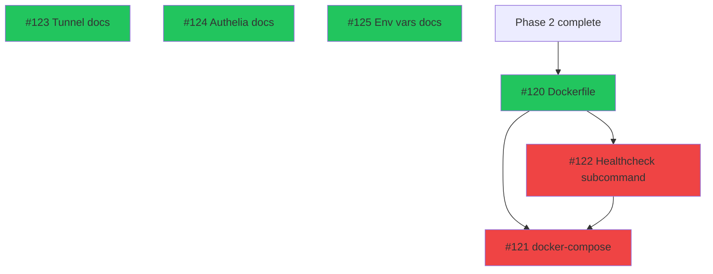

# Phase 3: Deployment & Production

> 6 issues across 1 track. **3 ready** (when Phase 2 completes), 3 blocked by internal dependencies.
> Updated: 2026-03-24

## Summary

| Track | Name              | Total | Ready | Blocked | Epic | Notes                     |
| ----- | ----------------- | :---: | :---: | :-----: | ---- | ------------------------- |
| A     | Docker + Docs     |   6   |   3   |    3    | #12  | Deployment + documentation|
|       | **Total**         | **6** | **3** |  **3**  |      |                           |

**Critical path:** #120 (Dockerfile) → #122 (healthcheck) → #121 (compose) → deploy to almaz.subcult.tv

**Phase entry criteria:** Phase 2 complete (dashboard fully functional with live data, SUBCULT aesthetic, all features working in dev).

**Phase exit criteria:** ALMAZ running in production at `almaz.subcult.tv` behind Authelia, replacing Dashy. Docker image built from scratch. Deployment process documented.

---

## Track A: Docker Deployment + Documentation

> Production Dockerfile, compose integration, deployment documentation.
> Depends on: Phase 2 (entire application must be working)

| #   | Issue                                                         | Title                                               | Size | Blocker | Status  | Notes                          |
| --- | ------------------------------------------------------------- | --------------------------------------------------- | :--: | ------- | ------- | ------------------------------ |
| 1   | [#120](https://github.com/PatrickFanella/dash/issues/120)     | Production multi-stage Dockerfile                   |  M   | Phase 2 | READY   | Node → Go → scratch           |
| 2   | [#123](https://github.com/PatrickFanella/dash/issues/123)     | Cloudflare Tunnel configuration documentation       |  S   | None    | READY   | Pure docs, can write anytime   |
| 3   | [#124](https://github.com/PatrickFanella/dash/issues/124)     | Authelia protected application documentation        |  S   | None    | READY   | Pure docs, can write anytime   |
| 4   | [#125](https://github.com/PatrickFanella/dash/issues/125)     | Environment variables reference documentation       |  S   | None    | READY   | Pure docs, can write anytime   |
| 5   | [#122](https://github.com/PatrickFanella/dash/issues/122)     | Healthcheck subcommand for scratch container        |  S   | #120    | BLOCKED | Needed for compose healthcheck |
| 6   | [#121](https://github.com/PatrickFanella/dash/issues/121)     | docker-compose service definition                   |  S   | #120    | BLOCKED | Depends on working Dockerfile  |



**Parallelizable:** Documentation issues (#123, #124, #125) are fully independent and can be written at any point — even during earlier phases. The Dockerfile chain (#120 → #122 → #121) is sequential.

**Note:** Documentation issues have no actual code dependencies. They can be started during Phase 1 or Phase 2 to front-load work. The Dockerfile (#120) depends on Phase 2 only in the sense that the full build must work — a draft Dockerfile can be started earlier and finalized once all features are in place.

---

## Phase 3 Execution Order

```
Day 1:   Documentation (parallel) + Dockerfile
         ├── #123 Cloudflare Tunnel docs
         ├── #124 Authelia docs
         ├── #125 Environment variables reference
         └── #120 Production Dockerfile (finalize multi-stage build)

Day 2:   Container deployment
         ├── #122 Healthcheck subcommand
         └── #121 docker-compose service definition

Day 3:   Production cutover
         ├── Update Cloudflare Tunnel: almaz.subcult.tv → ALMAZ container
         ├── Add ALMAZ to Authelia access control
         ├── Seed production database: almaz seed --config /opt/server/management/config/dashy/conf.yml
         └── Verify: dashboard live at almaz.subcult.tv with all services, health, metrics
```

---

## Post-MVP Roadmap

Once ALMAZ is running in production, the following features are tracked but not yet broken into issues:

| Feature                    | Description                                                       | Depends on |
| -------------------------- | ----------------------------------------------------------------- | ---------- |
| WebSocket push             | Real-time updates replacing REST polling                          | Phase 3    |
| Interactive controls       | Container restart, service actions from dashboard                 | WebSocket  |
| Aggregated feeds           | Plex activity, RSS items, git commits on dashboard                | Phase 3    |
| Command palette            | Quick-jump search across all 40+ services                         | Phase 3    |
| Notifications/alerts       | Surface health issues directly on dashboard                       | Phase 3    |
| Admin UI                   | Manage services, sections, settings via web interface              | Phase 3    |

These will be scoped into Phase 4+ epics when the MVP is stable in production.
